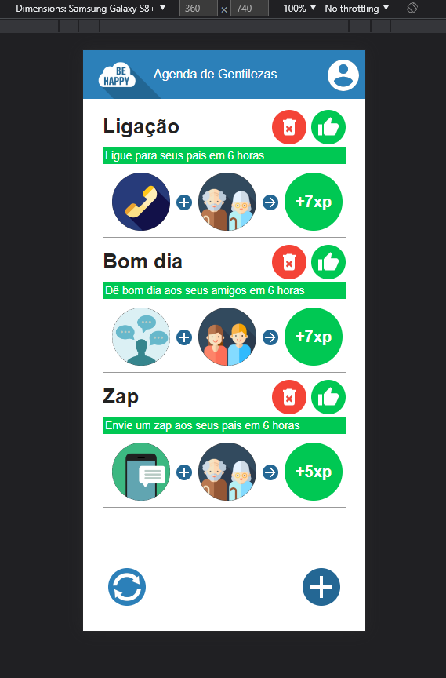

  

# behappywith.me

É um projeto [PWA](https://learn.microsoft.com/en-us/microsoft-edge/progressive-web-apps-chromium/) baseado no livro [Progressive Web Apps](https://www.casadocodigo.com.br/products/livro-pwa)
Onde o autor contextualiza os conceitos de PWA em consjunto com a criação de uma pwa colocando todas as explicações em prática.

  

